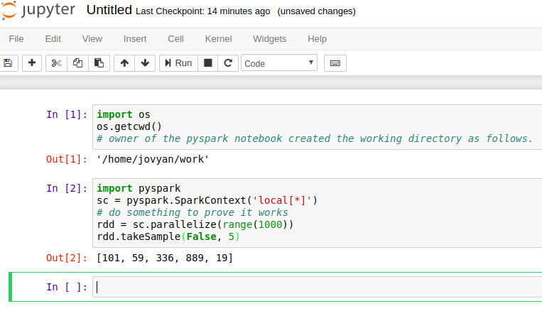
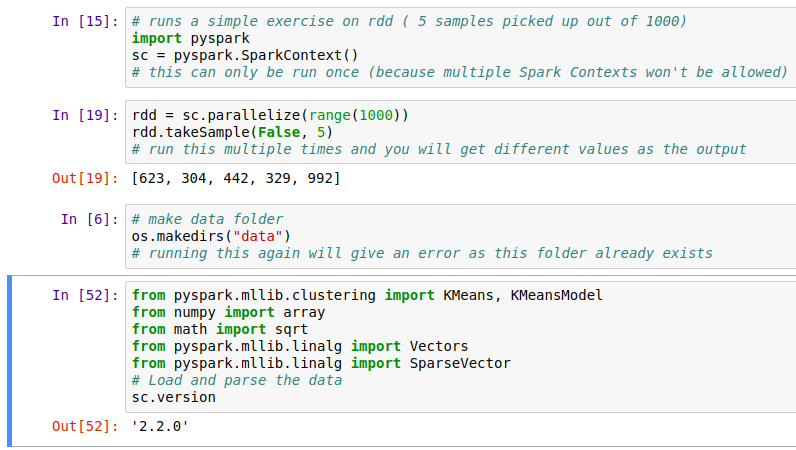
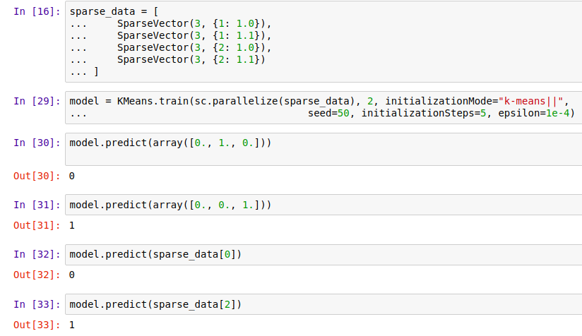
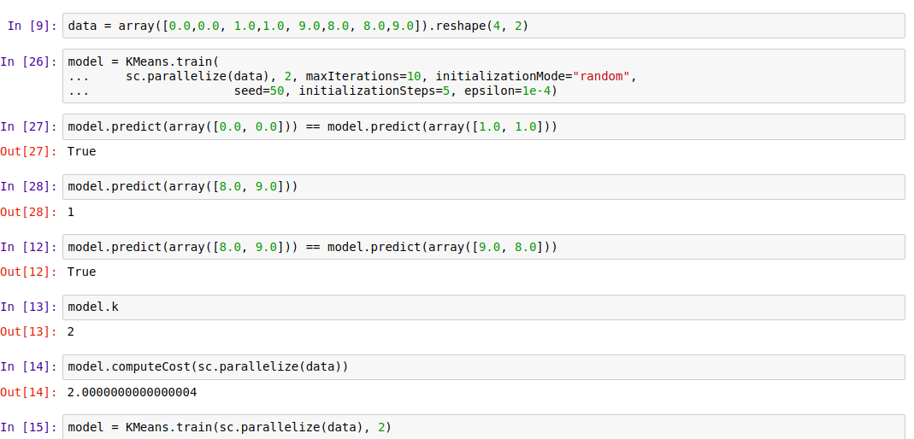
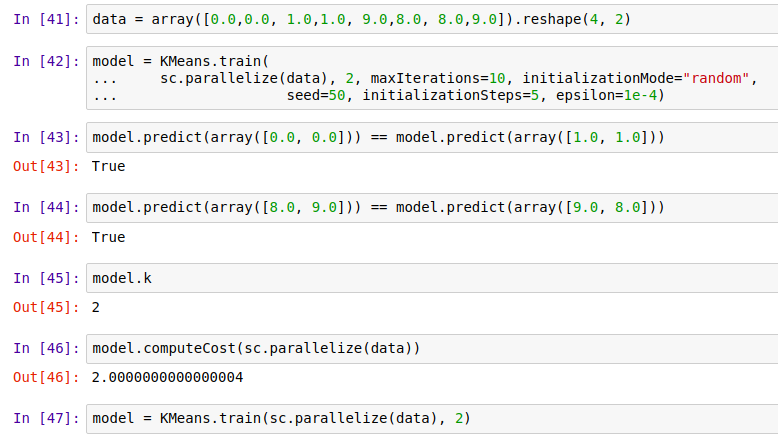
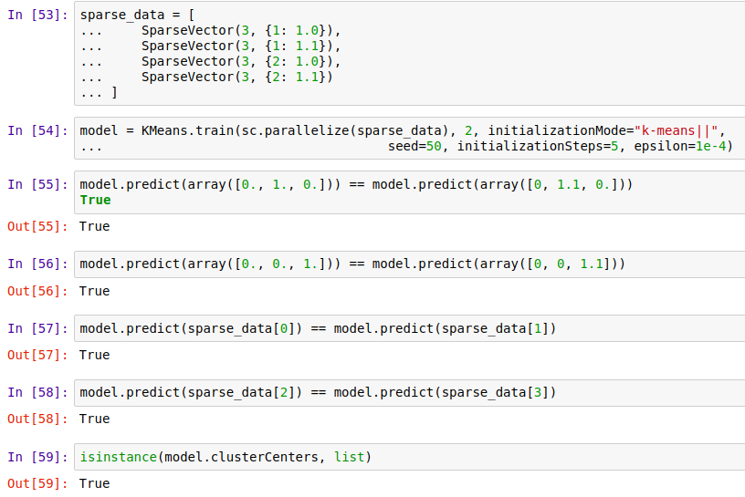

# Apache Spark with Docker

## Pull Image from Docker Repository

We use a Docker image from Docker Hub:
(https://hub.docker.com/r/sequenceiq/spark/) This repository contains a
Docker file to build a Docker image with Apache Spark and Hadoop Yarn.

    docker pull sequenceiq/spark:1.6.0

## Running the Image

In this step, we will launch a Spark container.

### Running interactively

    docker run -it -p 8088:8088 -p 8042:8042 -h sandbox sequenceiq/spark:1.6.0 bash

### Running in the background

    docker run -d -h sandbox sequenceiq/spark:1.6.0 -d

## Run Spark

After a container is launched, we can run Spark in the following two
modes: 1) yarn-client and 2) yarn-cluster. The differences between the
two modes can be found here:
https://spark.apache.org/docs/latest/running-on-yarn.html

### Run Spark in Yarn-Client Mode

    spark-shell --master yarn-client --driver-memory 1g --executor-memory 1g --executor-cores 1

### Run Spark in Yarn-Cluster Mode

    spark-submit --class org.apache.spark.examples.SparkPi --master yarn-client --driver-memory 1g --executor-memory 1g --executor-cores 1 $SPARK_HOME/lib/spark-examples-1.6.0-hadoop2.6.0.jar

## Observe Task Execution from Running Logs of Spark Pi

Let us observe Spark task execution by adjusting the parameter of
SparkPi and the Pi result from the following two commands.

    spark-submit --class org.apache.spark.examples.SparkPi --master yarn-client --driver-memory 1g --executor-memory 1g --executor-cores 1 $SPARK_HOME/lib/spark-examples-1.6.0-hadoop2.6.0.jar 10

    spark-submit --class org.apache.spark.examples.SparkPi --master yarn-client --driver-memory 1g --executor-memory 1g --executor-cores 1 $SPARK_HOME/lib/spark-examples-1.6.0-hadoop2.6.0.jar 10000

## Write a Word-Count Application with Spark RDD

Let us write our own word-count with Spark RDD. After the shell has been
started, copy and paste the following code in console line by line.

### Launch Spark Interactive Shell

    spark-shell --master yarn-client --driver-memory 1g --executor-memory 1g --executor-cores 1

### Program in Scala

    val textFile = sc.textFile("file:///etc/hosts")
    val words = textFile.flatMap(line => line.split("\\s+"))
    val counts = words.map(word => (word, 1)).reduceByKey(_ + _)
    counts.values.sum()

### Launch PySpark Interactive Shell

    pyspark --master yarn-client --driver-memory 1g --executor-memory 1g --executor-cores 1

### Program in Python

    textFile = sc.textFile("file:///etc/hosts")
    words = textFile.flatMap(lambda line:line.split())
    counts = words.map(lambda word:(word, 1)).reduceByKey(lambda x,y: x+y)
    counts.map(lambda x:x[1]).sum()

#### etc/hosts 
The file has the following content with 16 words.

    127.0.0.1	localhost
    ::1	 localhost ip6-localhost ip6-loopback
    fe00::0 ip6-localnet
    ff00::0 ip6-mcastprefix
    ff02::1 ip6-allnodes
    ff02::2 ip6-allrouters
    172.17.0.2	sandbox
    
    
 
    

# Docker Spark Labs (5.35 PM EST, 2018/03/08)

## Docker Spark Examples 

### K-Means Example 

First we need to pull the image from the Docker Hub :

    docker pull sequenceiq/spark-native-yarn

It will take sometime to download the image. Now we have to run docker spark image interactively.

	docker run -i -t -h sandbox sequenceiq/spark-native-yarn /etc/bootstrap.sh -bash
	
This will take you to the interactive mode. 

Let's run a sample KMeans example. This is already built with Spark. 

Here we specify the data data set from a local folder inside the image
and we run the sample class KMeans in the sample package. The sample
data set used is inside the sample-data folder. Spark has it's own
format for machine learning datasets. Here the kmeans_data.txt file
contains the KMeans dataset.

	./bin/spark-submit --class sample.KMeans --master execution-context:org.apache.spark.tez.TezJobExecutionContext --conf update-classpath=true ./lib/spark-native-yarn-samples-1.0.jar /sample-data/kmeans_data.txt

If you run this successfully, you can get an output as shown here. 

	Finished iteration (delta = 0.0)
	Final centers:
	DenseVector(0.15000000000000002, 0.15000000000000002, 0.15000000000000002)
	DenseVector(9.2, 9.2, 9.2)
	DenseVector(0.0, 0.0, 0.0)
	DenseVector(9.05, 9.05, 9.05)
	
### Join Example

Run the following command to do a sample join operation on a given
dataset. Here we use two datasets, namely join1.txt and
join2.txt. Then we perform the join operation that we discussed in the
theory section.

	./bin/spark-submit --class sample.Join --master execution-context:org.apache.spark.tez.TezJobExecutionContext --conf update-classpath=true ./lib/spark-native-yarn-samples-1.0.jar /sample-data/join1.txt /sample-data/join2.txt
	
### Word  Count

In this example the wordcount.txt will used to do the word count using
multiple reducers. Number 1 at the end of the command determines the
number of reducers. As spark can run multiple reducers, we can specify
the number as a parameter to the programme.

	./bin/spark-submit --class sample.WordCount --master execution-context:org.apache.spark.tez.TezJobExecutionContext --conf update-classpath=true ./lib/spark-native-yarn-samples-1.0.jar /sample-data/wordcount.txt 1

## Interactive Examples

Here we need a new image to work on. Let's run the following
command. This will pull the necessary repositories from docker hub, as
we don't have most of the dependencies related to it. This can take a
few minutes to download everything.

	docker run -it-p 8888:8888 -v $PWD:/cloudmesh/spark --name spark jupyter/pyspark-notebook
	
Here you will get the following output in the terminal. 

Please copy the url shown at the end of the terminal output and go to
that url in the browser.

You will see the following output in the browser, (Use Google Chrome)

First navigate to the work folder. Let us create a new python file
here. Click python3 in the new menu. 

Now add the following content in the new file. In Jupyter notebook, 
you can enter a python command or python code and press

	SHIFT + ENTER

This will run the code interactively. 

Now let's create the following content. 

Now let us do the following. 

In the following stage we configure spark context and 
import the necessary files. 

Next stage we use sample data set by creating them 
in form of an array and we train the kmeans algorithm. 

In the final stage we put sample values and check the 
predictions on the cluster. In addition to that feed the data
using SparseVector format and we add the kmeans initialization 
mode, the error margin and the parallelization. We put the 
step size as 5 for this example. In the previous one we didn't 
specify any parameters. 

The predict term predicts the cluster id which it belongs to. 

Then in the following way you can check whether two data points belong
to one cluster or not. 

### Stop Docker Container

	docker stop spark
	
### Start Docker Container Again

	docker start spark
	
### Remove Docker Container

	docker rm spark
