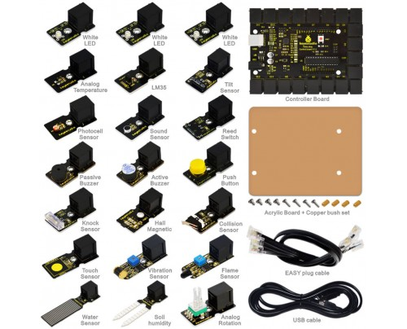

# Easy Plug

Copied from: 

* http://wiki.keyestudio.com/index.php/Ks0099_keyestudio_EASY_plug_Control_Board


Keyestudio Easy-plug control board is a microcontroller board based on the ATmega328P-PU. It has 14 digital input/outputs (of which 6 can be used as PWM outputs), 6 analog inputs, a 16 MHz quartz crystal, a USB connection, a power jack, an ICSP header and a reset button. It contains everything needed to support the microcontroller; simply connect it to a computer with a USB cable or power it with a AC-to-DC adapter or battery to get started.You can tinker with your UNO without worrying too much about doing something wrong, worst case scenario you can replace the chip for a few dollars and start over again.
For convenience of wire connection, we simplify pins GND and VCC into each plug, so you only need one wire to connect a module, no need to separately connect the VCC and GND. The pins on the original UNO are all redesigned into plug interface. On the board, you can find ports D2-D13, A0 to A5, an IIC port and a COM port. All in one simple plug.


## Specifications

Microcontroller core |	ATmega328P-PU
--- | ---
Working voltage|	+5V
External input voltage|	+7V~+12V（suggest）
External input voltage ( extremum )|	+6V≤ Vin ≤ ＋20V
Digital signal I/O interface|	14 (of which 6 provide PWM output)
Analog signal input interface|	6
DCI/O interface current|	20 mA
FlashMemory|	32KB (ATmega328) of which 0.5 KB used by bootloader
SRAM static storage capacity|	2KB
EEPROM storage capacity|	1 KB
EEPROM storage capacity|	16 MHz


## Connect

Tools -> Arduino/Genuin Arduino

port oon OSX will loock something like this:

* /dev/cu.usbmodem1461

## Test code

```
int command;
int port;

int pin_from = 5;
int pin_to = 13;

void Light(int pin){
  digitalWrite(pin,HIGH);
  delay(500);
  digitalWrite(pin,LOW);
}

void setup() {
  Serial.begin(9600);
  int i;
  for (i = pin_from; i <= pin_to; i++){
    pinMode(i,OUTPUT);
  }
}


void loop() {
 command=Serial.read();
  if(command=='a') {
    int i;
    for (i = pin_from; i <= pin_to; i++){
      Light(i);    
      Serial.print("Led ");
      Serial.println(i);
      delay(100);
    }
  }
}
```


## Kit List

* http://www.keyestudio.com/keyestudio-easy-plug-learning-kit-for-arduino-super-makers.html




Part | Number
--- | ---
EASY plug controller Board |1
Acrylic Board + Copper bush set| 1
EASY plug cable| 3
USB cable | 1
EASY plug Piranha LED Module| 3
EASY plug Line Tracking Sensor| 1
EASY plug Infrared obstacle avoidance sensor| 1
EASY plug Photo Interrupter Module| 1
EASY plug PIR Motion Sensor| 1
EASY plug DS18B20 Temperature Sensor| 1
EASY plug IR Receiver Module| 1
EASY plug IR Transmitter Module| 1
EASY plug Single Relay Module| 1
EASY plug ADXL345 Three Axis Acceleration Module| 1
EASY plug DHT11 Temperature and Humidity Sensor| 1
EASY plug DS3231 Clock Module| 1
EASY plug Analog Gas Sensor |1
EASY plug Analog Alcohol Sensor| 1
EASY plug MQ135 Air Quality Sensor| 1
EASY plug BMP180 Barometric Pressure Sensor| 1
EASY plug Bluetooth Module| 1
EASY plug 1602 I2C Module| 1
EASY plug I2C 8x8 LED Matrix| 1

 
 
## Command Language 

on PORT

*  switches PORT on 
  
off PORT

*  switches port off
  
on all

*   switches all ports on
   
off all

*   switches all ports off
   
dance

*   goes serially through ports and switches them on and off


``` 
String command;


int pin_from = 5;
int pin_to = 13;

String getValue(String data, char separator, int index)
{
  // copied from internet
    int found = 0;
    int strIndex[] = { 0, -1 };
    int maxIndex = data.length() - 1;

    for (int i = 0; i <= maxIndex && found <= index; i++) {
        if (data.charAt(i) == separator || i == maxIndex) {
            found++;
            strIndex[0] = strIndex[1] + 1;
            strIndex[1] = (i == maxIndex) ? i+1 : i;
        }
    }
    return found > index ? data.substring(strIndex[0], strIndex[1]) : "";
}

void Light(int pin, int action){
  if (action ==  1) {
    digitalWrite(pin,HIGH);
  } else {
    digitalWrite(pin,LOW);
  }
}

void wait_for_input() {
  while (Serial.available()==0) { } 
}

void setup() {
  Serial.begin(9600);
  int i;
  for (i = pin_from; i <= pin_to; i++){
    pinMode(i,OUTPUT);
  }
}


void loop() {
 
  Serial.print("command:");
  wait_for_input();
  command=Serial.readString();  
  Serial.println (command);

   if (command=="dance") {     
      for (int i = pin_from; i <= pin_to; i++) {
        Light(i,1);
        delay(100);
        Light(i,0);    
        Serial.print("Led ");
        Serial.println(i);
        delay(100);
      }
    } else {
      
      int action;
      String action_name = getValue(command, ' ', 0);
      String port_name = getValue(command, ' ', 1);

      action = action_name == "on";
    
      if (port_name == "all") {
        for (int i = pin_from; i <= pin_to; i++){
          Light(i,action);   
          Serial.print("Led ");
          Serial.println(i);
        }
      } else {
        int port = port_name.toInt();

        Serial.println(action);
        Serial.println(port);
        Light(port, action);
     }
  }
}
```
