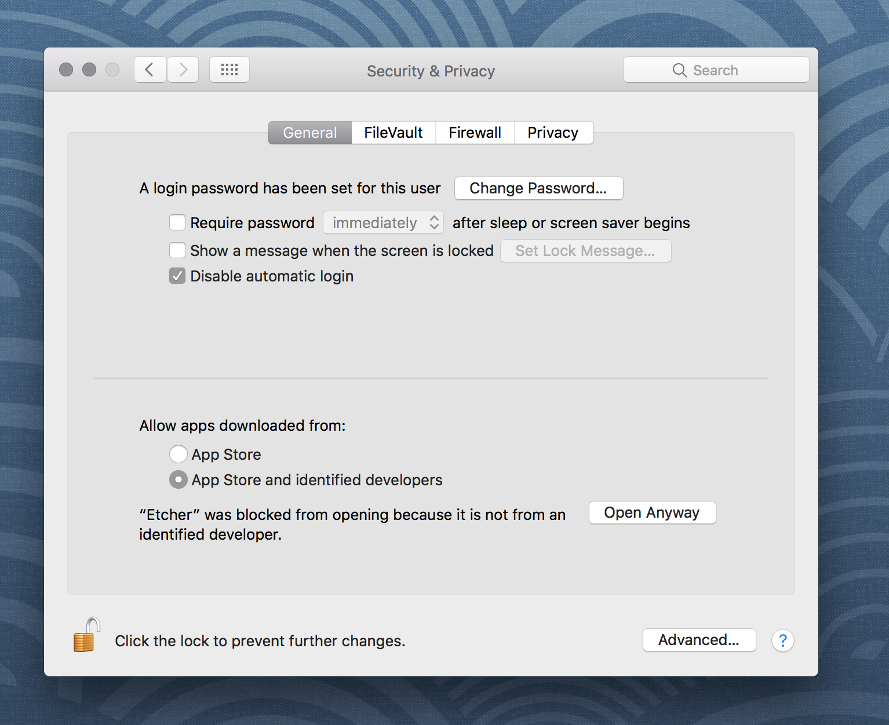
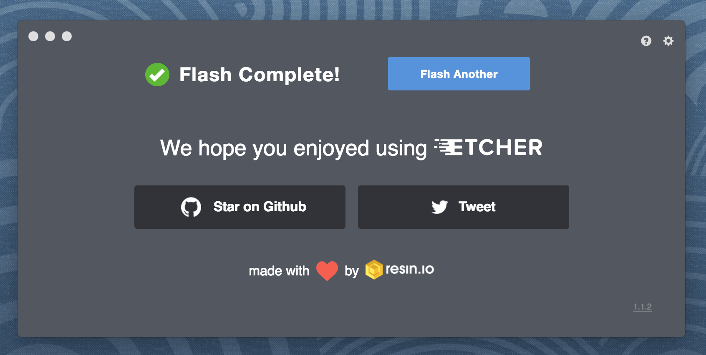
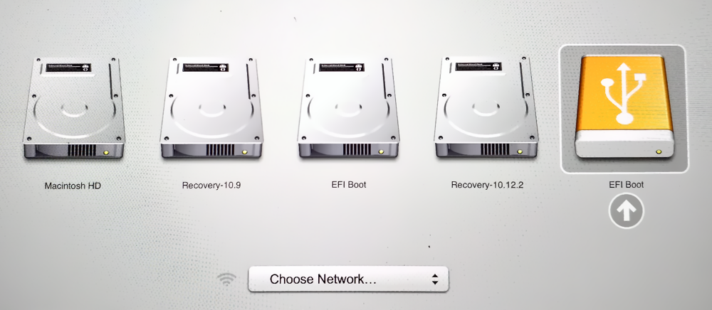

# Create a USB stick with Ubuntu from OSX

The original Web page for this method is available at 

* [https://help.ubuntu.com/community/How%20to%20install%20Ubuntu%20on%20MacBook%20using%20USB%20Stick](https://help.ubuntu.com/community/How%20to%20install%20Ubuntu%20on%20MacBook%20using%20USB%20Stick)

We have copied some of the information from this Web page but made enhancements to it. 
Currently all images are copied form that Web page.

Our goal is to create a USB stick that has either Ubuntu 16.04.03 or ubuntu 17.10.1 on it.

This can be achieved while visiting the URL 

* [https://www.ubuntu.com/download/desktop](https://www.ubuntu.com/download/desktop)

First we assume that you downloaded to iso from ubuntu to a folder called *iso*. Next we open a terminal and cd into the folder *iso*. Now we need to convert the is to an image file. This is done as follows and you need to execute the command for the version of ubuntu you like to use.

Your folde will look something like this 

	ls -1
	
		ubuntu-16.04.3-desktop-amd64.iso
		ubuntu-17.10.1-desktop-amd64.iso

For 17.10.1 you will need to generate an image with the following command

	hdiutil convert ubuntu-17.10.1-desktop-amd64.iso -format UDRW -o ubuntu-17.10.1-desktop-amd64.img

For 16.04.3 you will need  to generate an image with the following command

	hdiutil convert ubuntu-16.04.3-desktop-amd64.iso -format UDRW -o ubuntu-16.04.3-desktop-amd64.img

OSX will append a  .dmg behind the name. When considering the OS and you only want to use one, we 
recommend that you use the latest OS. Please let us know if we need to update the verion numbers. Check with the ubuntu Web page.

At this time do not plug in your usb stick. Just issue the command 

	diskutil list

Observe the output. Now plug in the USB stick. Wait till the USB stick registers in the Finder. 
If this does not work find a new USB stick or format it. Execute the command 

	diskutil list

and observer the output again. Another devce will register and you will see something like

	/dev/disk2 (external, physical):
	#:     TYPE NAME               SIZE       IDENTIFIER
	0:     FDisk_partition_scheme *8.2 GB     disk2
	1:     DOS_FAT_32 NO NAME      8.2 GB     disk2s1

Please note in this example the device path and number is recognized as 

	/dev/disk2
	
It also says external, which is a good sign as the USB stick is external. Next, we need to unmoundt the device with 

	diskutil unmountDisk /dev/diskN

where you replace the number N with the disk number that you found for the device. In our example it would be 2. If you see the error "Unmount of diskN failed: at least one volume could not be unmounted", start Disk Utility.app and unmount the volume (don't eject). If it was successful, you will see 

	Unmount of all volumes on disk2 was successful

The next step is dangerous and you need to make 
sure you follow it. So please do not copy and paste, but read first, 
reflect and only if you understand it execute it. We know we say this 
all the time, but better saying it again instead of you destryoing your system. This command also requires sudo access so you will either have to be in the sudo group, or use 

	su <your administrator name>
	
login and than execute the command under root.

	sudo dd if=ubuntu-17.10.1-desktop-amd64.img.dmg of=/dev/diskN bs=1m

(Not tested: Using /dev/rdisk instead of /dev/disk may be faster according to the ubuntu documentation)

Ubuntu's Web page also gives the following tips:

* "If you see the error dd: Invalid number '1m', you are using GNU dd. Use the same command but replace bs=1m with bs=1M."
* "If you see the error dd: /dev/diskN: Resource busy, make sure the disk is not in use. Start Disk Utility.app and unmount the volume (don't eject)."

You will see an error window popping up telling you: **The disk inserted was not readbale by this compute**. Please, leave the window as is  and instead type in on the terminal.

	diskutil eject /dev/diskN
	
Now remove the flash drive, and press in the error window **Ignore**	
Now you have a falsh drive with ubuntu installed and you can boot from it. To do so, please 

**restart your Mac and press option key**

while the Mac is restarting to choose the USB-Stick

You will need a plug for USB keyboard, USB mouse, and netwwork cable.

There are some issue from this point on.

	sudo apt-get update

Add universe to the window for application updates

see https://help.ubuntu.com/community/Repositories/Ubuntu

	sudo apt-get install vnc4server

	
Start the server and set up a password

	vncserver

\begin{WARNING}
The next section is untested and needs verification. 
\end{WARNING}

# Ubuntu on a USB stick for OSX

The material in thi section was copied from 

* https://tutorials.ubuntu.com/tutorial/tutorial-create-a-usb-stick-on-macos

## Requirements

You will need:

* A 2GB or larger USB stick/flash drive
* An Apple computer or laptop running macOS
* An Ubuntu ISO file. See Get Ubuntu for download links https://www.ubuntu.com/download

## Install Etcher

To write the ISO file to the USB stick, we're going to use a free and open source application called Etcher. After downloading this and clicking to mount the package, Etcher can either be run in-place or dragged into your Applications folder.

* https://etcher.io/

By default, recent versions of macOS block the running of applications from unidentified developers. To side-step this issue, enable ‘App Store and identified developers' in the ‘Security & Privacy' pane of System Preferences. If you are still warned against running the application, click ‘Open Anyway' in the same pane.

## Prepare the USB stick

**Warning: Disk Utility needs to be used with caution as selecting the wrong device or partition can result in data loss.**

* Launch Disk Utility from Applications>Utilities or Spotlight search
* Insert your USB stick and observe the new device added to Disk Utility
* Select the USB stick device and select Erase from the tool bar (or right-click menu)
* Set the format to MS-DOS (FAT) and the scheme to GUID Partition Map
Check you've chosen the correct device and click Erase

## Etcher configuration

Etcher will configure and write to your USB device in three stages, each of which needs to be selected in turn:

* Select image will open a file requester from which should navigate to and select the ISO file downloaded previously. By default, the ISO file will be in your Downloads folder.
* Select drive, replaced by the name of your USB device if one is already attached, lets you select your target device. You will be warned if the storage space is too small for your selected ISO.
* Flash! will activate when both the image and the drive have been selected. As with Disk Utility, Etcher needs low-level access to your storage hardware and will ask for your password after selection.

# Write to the USB stick

Write to device

After entering your password, Etcher will start writing the ISO file to your USB device.

The Flash stage of the process will show progress, writing speed and an estimated duration until completion. This will be followed by a validation stage that will ensure the contents of the USB device are identical to the source image.

When everything has finished, Etcher will declare the process a success.

Congratulations! You now have Ubuntu on a USB stick, bootable and ready to go.

**Warning: After the write process has completed, macOS may inform you that ‘The disk you inserted was not readable by this computer'. Don't select Initialise. Instead, select Eject and remove the USB device.**

## Boot from the USB Stick

oot your Mac

If you want to use your USB stick with an Apple Mac, you will need to restart or power-on the Mac with the USB stick inserted while the Option/alt(⌥) key is pressed.

This will launch Apple's ‘Startup Manager' which shows bootable devices connected to the machine. Your USB stick should appear as gold/yellow and labelled ‘EFI Boot'. Selecting this will lead you to the standard Ubuntu boot menu.

If you want to install Ubuntu, follow our install Ubuntu desktop tutorial.

* https://tutorials.ubuntu.com/tutorial/tutorial-install-ubuntu-desktop#0

